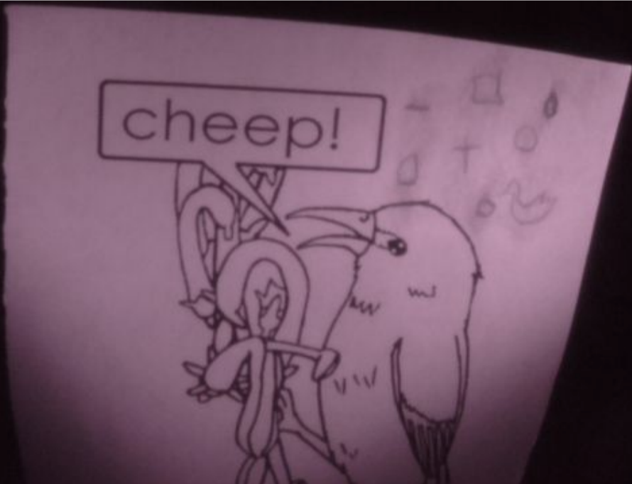

# Near Infrared Camera

This is the python code for a Raspberry Pi connected to NIR lenses to take and save photos in near-infrared. This NIR camera was used, among other things, to study the pigment composition in the sarcrophargus in the Wayne County Historical Museum. 
The project was cost effective compared to commericially available near-infrared cameras. We ordered the components separarely, 3-D printed mounts for the lenses, and assembled it into a functioning image taking system.

## Assembly

- GemRed 82305 Stainless Steel Digital Protractor (500mm)
- Adafruit Super-bright 5mm IR LED
- Wang-Data Black Split Loom Braided Cable Sleeve 1/2 inch X 20ft (1/2" X 20')
- Adafruit Flex Cable for Raspberry Pi Camera - 18" / 457mm
- Raspberry Pi 3 Model B Motherboard
- Makerfocus Raspberry Pi Camera Night Vision Camera Adjustable-Focus Module 5MP OV5647 Webcam Video 1080p for Raspberry-Pi 3 Model B
- Gowoops 5V 2.5A Power Supply Adapter Charger for Raspberry Pi 3 2 Model B, Micro USB Cable with Switch On Off LED Indicator Light and 2 Heatsinks
- Raspberry Pi 7 Inch Monitor HDMI - SunFounder 7" 1024×600 HD LCD Display Screen Built in Speaker for Raspberry Pi 3 Model B+ 3B 2B B+ with RPi Case Holder
- Okela D8 Upgraded Mini Wireless Keyboard Touchpad Mouse, 2.4Ghz Backlit Handheld Rechargeable TV Keyboard Remote
- 100pcs X Super Bright 5mm Flat top Wide Angle led Light lamp white 120-140 deg

## Instructions

### Setup 
- Connect the monitor and the Raspberry Pi console attached to the monitor to a power supply, as shown below.

- Connect the wires as described in the figure and the tables.

- Connect the power cords, camera ribbon cable, and mini keyboards as shown.

- Place LEDs in LED holders as shown in the figure.

- Place LED holders on lego block stands (A1 and A2) and place onto goniometer ruler where desired. Screw camera mount onto tripod (B) and place
tripod in the center of the goniometer ruler.

- Remove lens cap. If taking an IR image, place the visible light filter lens on the camera as shown.

- Turn on the Raspberry-Pi 3 system and select Raspbian (Raspberry-Pi OS).

### Using the NIR Camera

- Click on NIR Camera.sh to open the program

- Control the LED, IR LED, and Camera with the “NIR Camera” control window. Click the LED or IR LED Button to turn on the light, click again to turn it
off. Click the Preview Button to open the preview window. Click the Capture Button to take a photo.
- Name the file and save it.

### Image examples

#### Without Filter

#### With Filter

